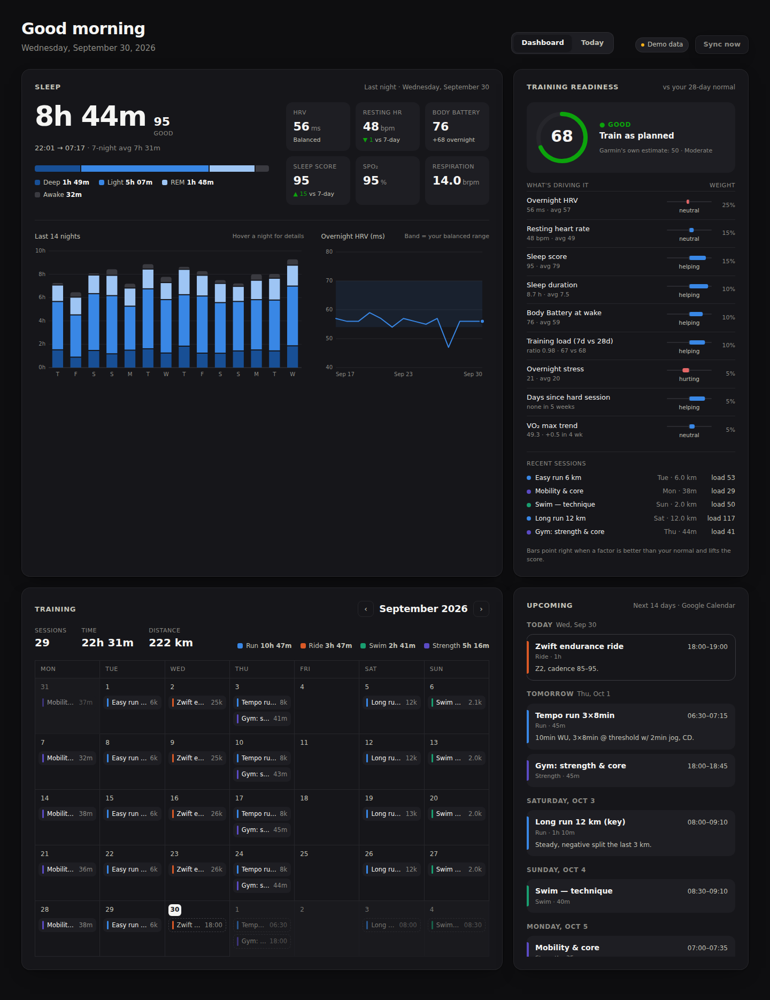
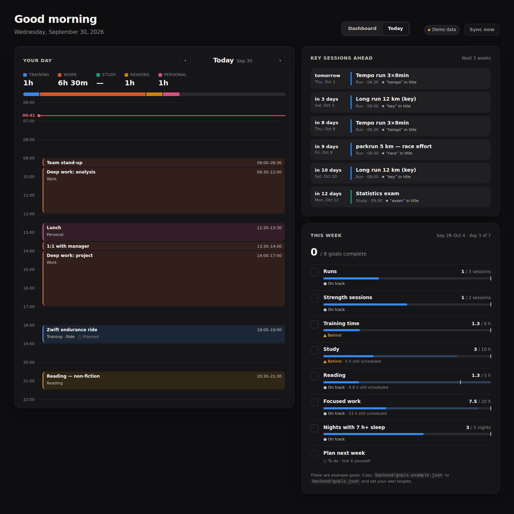

# Life Dashboard

A personal desktop dashboard for Garmin data, training, work and study.






**Dashboard** tab:

- **Sleep at a glance**: last night's duration, score and stages; HRV, resting HR, Body Battery, SpO₂ and respiration; a 14-night stage chart and an HRV trend against your balanced range.
- **Training calendar**: a month view of completed Garmin activities, colour-coded by sport, with monthly totals. Click a session for pace, heart rate, load and training effect. Planned sessions show as dashed chips on future days.
- **Upcoming sessions**: the next 14 days from Google Calendar, grouped by day.
- **Training readiness**: a 0–100 score with a breakdown of what's driving it; see below.

**Today** tab:

- **Your day**: an hour-by-hour plan from Google Calendar, colour-coded as training, work, study, reading, personal or other, with hours per area and a bar showing how the day is split. Planned training is checked against Garmin: ✓ done, or flagged if nothing matching was recorded. Garmin activities that weren't on the calendar show up too. Use ‹ › to move between days.
- **Key sessions ahead**: sessions flagged as key. For now the rule is a title keyword or a ★ in the title (`KEY_SESSION_KEYWORDS`); it will be refined.
- **This week**: a checklist that ticks itself from Garmin and calendar data. Goals live in `backend/goals.json`; see below.

## Readiness score (v1)

Each recovery input is compared with your own previous 28 days. An input at your normal scores 50; 2.5 standard deviations better scores 100, and 2.5 worse scores 0. The inputs are then weighted:

| Input | Weight |
|---|---|
| Overnight HRV | 25 |
| Resting heart rate (lower is better) | 15 |
| Sleep score | 15 |
| Sleep duration | 10 |
| Body Battery at wake | 10 |
| Overnight stress (lower is better) | 5 |
| Training load: 7-day vs 28-day ratio (sweet spot 0.8–1.3) | 10 |
| Days since the last hard session | 5 |
| VO₂ max trend over 4 weeks | 5 |

Some caps override the average: HRV well below normal caps the score at 50, and under 5 h of sleep caps it at 55. Bands: 75+ ready for hard, 55+ train as planned, 35+ take it easier, below 35 recover. If an input is missing, the weights are rebalanced across the rest. Weights and thresholds live at the top of `backend/app/readiness.py`.

```
backend/   FastAPI + SQLite. Syncs Garmin (python-garminconnect) and reads Google Calendar (iCal)
frontend/  React + Vite + TypeScript. Dashboard UI; hand-drawn SVG charts, no chart library
```

## Quick start (demo data, no accounts needed)

```bash
# backend
cd backend
python3 -m venv .venv && source .venv/bin/activate      # Windows: .venv\Scripts\activate
pip install -r requirements.txt
DEMO_MODE=true uvicorn app.main:app --port 8000          # or set DEMO_MODE=true in .env

# frontend (second terminal)
cd frontend
npm install
npm run dev                                              # http://localhost:5173
```

## Using your real data

1. `cp backend/.env.example backend/.env` and fill it in.
2. **Garmin**: set `GARMIN_EMAIL`/`GARMIN_PASSWORD`, then log in once interactively (this handles MFA and caches tokens in `~/.garminconnect`):
   ```bash
   cd backend && python -m scripts.garmin_login
   ```
   After that you can remove the password from `.env`. The first sync backfills `BACKFILL_DAYS` (default 90) of history, which takes a few minutes. After that only new and recent days are fetched, every `SYNC_INTERVAL_MINUTES`, or when you click **Sync now**.
3. **Google Calendar**: for each calendar, open *Settings → (calendar) → Integrate calendar* and copy the **Secret address in iCal format**.
   - If an area has its own calendar, put it in `GCAL_TRAINING_ICS_URLS`, `GCAL_WORK_ICS_URLS`, `GCAL_STUDY_ICS_URLS`, `GCAL_READING_ICS_URLS` or `GCAL_PERSONAL_ICS_URLS`. Every event in it gets that category.
   - Put mixed calendars in `GCAL_ICS_URLS`. Their events are categorised by title: sport words → training, "lecture/study/exam…" → study, "meeting/stand-up/work…" → work, "read/book…" → reading, "lunch/groceries/friends…" → personal. Add your own words with `*_KEYWORDS`.
   - The sport comes from the title too ("run", "Zwift", "swim", "gym", …).
4. **Weekly goals**: `cp backend/goals.example.json backend/goals.json` and edit it. Each goal has a metric that the app measures for you:

   | metric | counts | options |
   |---|---|---|
   | `activity_count` / `activity_hours` / `activity_km` | Garmin activities | `sport` (one or a list), `name_contains`, `min_minutes` |
   | `calendar_hours` / `calendar_count` | calendar blocks that have ended | `category`, `title_contains` |
   | `sleep_nights` | nights meeting a bar | `min_hours`, `min_score` |
   | `step_days` | days meeting a bar | `min_steps` |
   | `manual` | you tick it on the dashboard | |

   Add `"mode": "at_most"` for caps, for example a weekly running-km limit.

> This uses Garmin's *unofficial* API (the same one the Garmin Connect website uses). It's fine for personal use, but it can break when Garmin changes things. If it does, upgrade the library first: `pip install -U garminconnect`.

Raw Garmin responses are stored untouched in `backend/data/lifedashboard.sqlite3` and normalised when read. New metrics can therefore be computed from your whole history without downloading anything again.

## Tests

```bash
cd backend && python -m pytest
cd frontend && npm run typecheck
```
